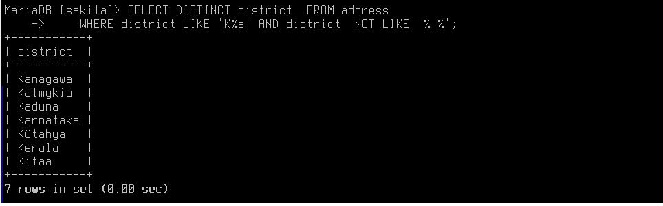
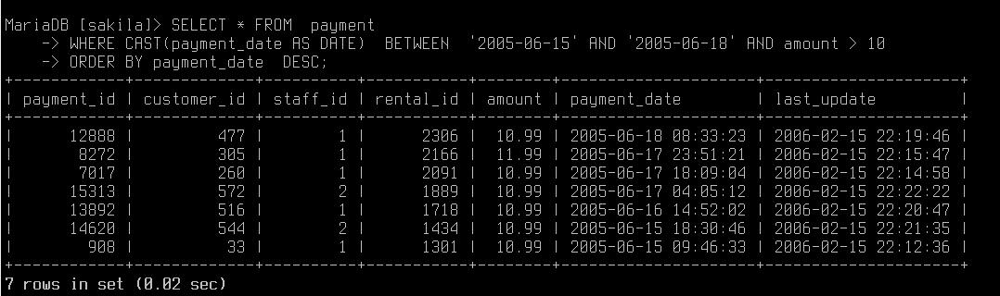
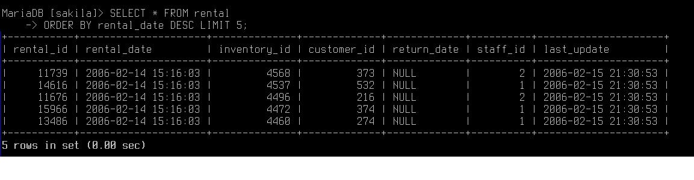
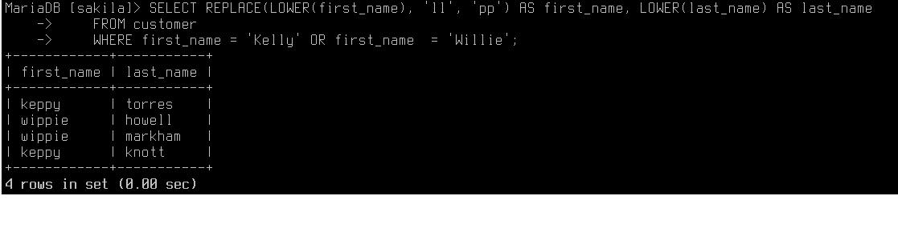
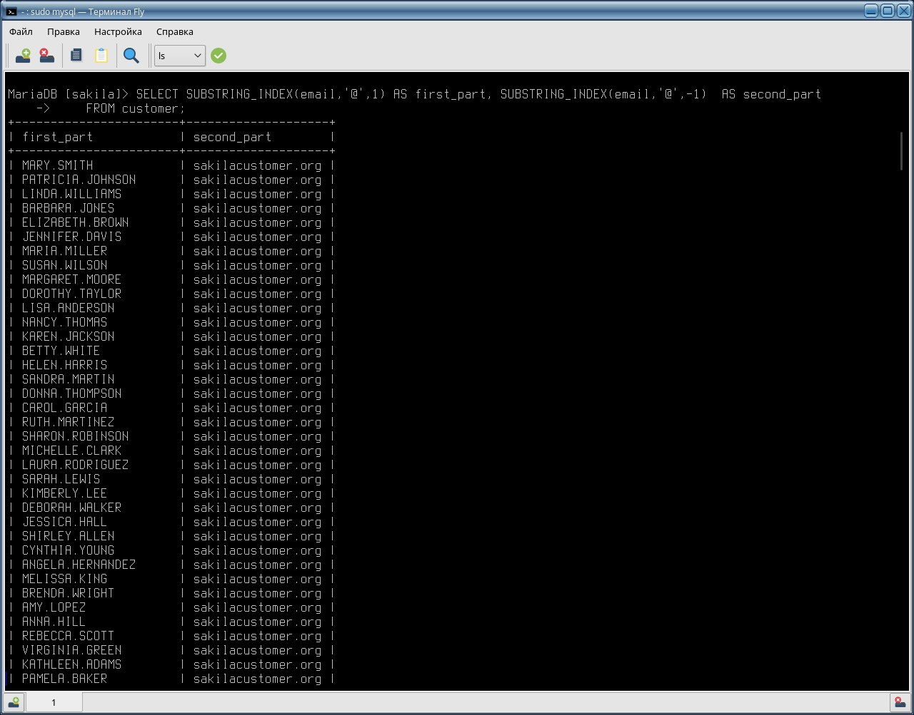

# Домашнее задание к занятию "`SQL. Часть 1`" - `Дьяконов Алексей


### Задание 1. Получите уникальные названия районов из таблицы с адресами, которые начинаются на “K” и заканчиваются на “a” и не содержат пробелов.

```
    SELECT DISTINCT district  FROM address 
    WHERE district LIKE 'K%a' AND district  NOT LIKE '% %';
```
-`


### Задание 2. Получите из таблицы платежей за прокат фильмов информацию по платежам, которые выполнялись в промежуток с 15 июня 2005 года по 18 июня 2005 года включительно и стоимость которых превышает 10.00.

```
    SELECT * FROM  payment 
    WHERE CAST(payment_date AS DATE)  BETWEEN  '2005-06-15' AND '2005-06-18' AND amount > 10
    ORDER BY payment_date  DESC;

```

-`

### Задание 3. Получите последние пять аренд фильмов.

```
    SELECT * FROM rental 
    ORDER BY rental_date DESC LIMIT 5;
```
-`

### Задание 4. Одним запросом получите активных покупателей, имена которых Kelly или Willie.

```
    SELECT REPLACE(LOWER(first_name), 'll', 'pp') AS first_name, LOWER(last_name) AS last_name
    FROM customer
    WHERE first_name = 'Kelly' OR first_name  = 'Willie';
```
-`

### Задание 5. 

```
    SELECT SUBSTRING_INDEX(email,'@',1) AS first_part, SUBSTRING_INDEX(email,'@',-1)  AS second_part
    FROM customer;
```
-`

### Задание 6.

```
    SELECT CONCAT(UPPER(LEFT(SUBSTRING_INDEX(email,'@',1),1)), SUBSTRING(LOWER(SUBSTRING_INDEX(email,'@',1)), 2)) AS first,
    CONCAT(UPPER(LEFT(SUBSTRING_INDEX(email,'@',-1),1)), SUBSTRING(LOWER(SUBSTRING_INDEX(email,'@',-1)), 2)) AS second
    FROM customer;
```
-`